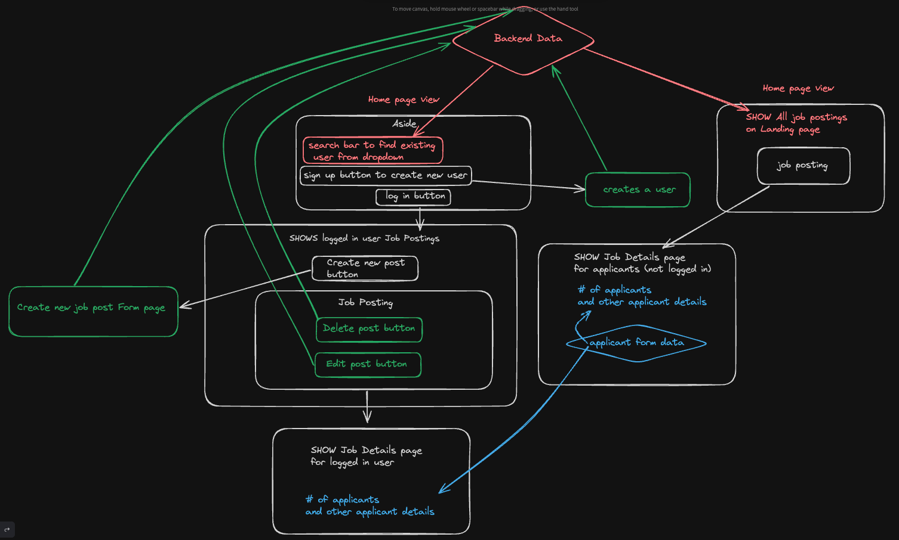
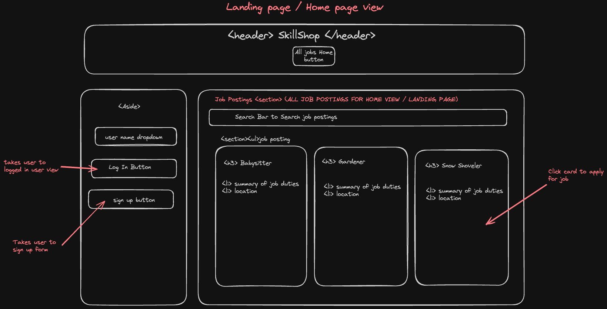
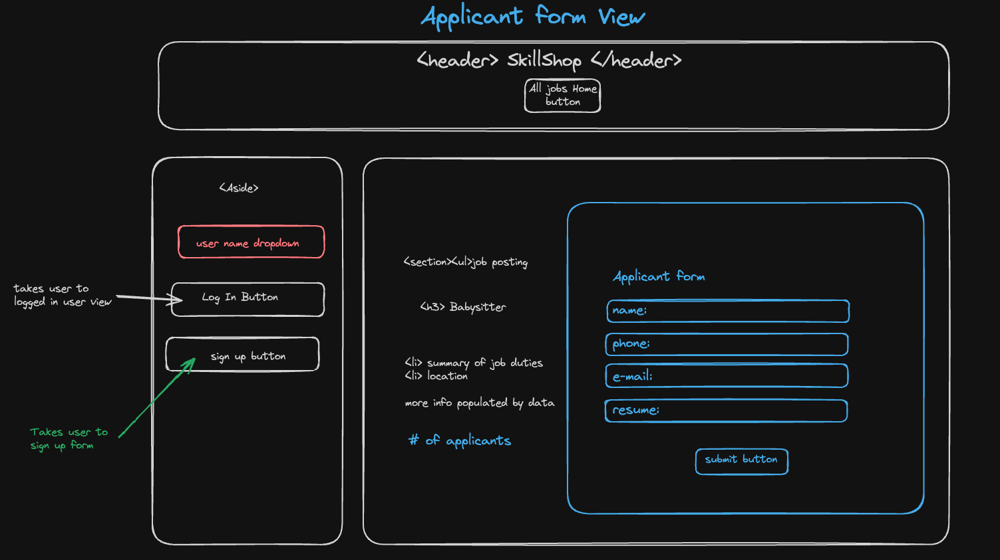
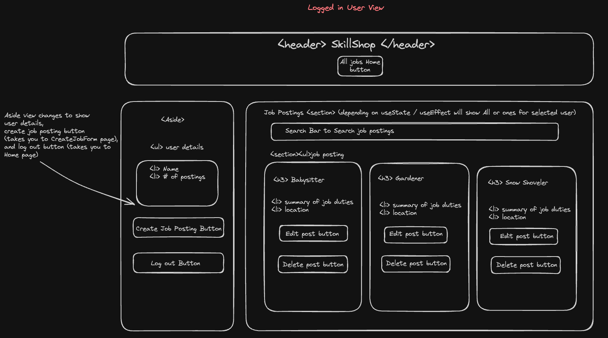
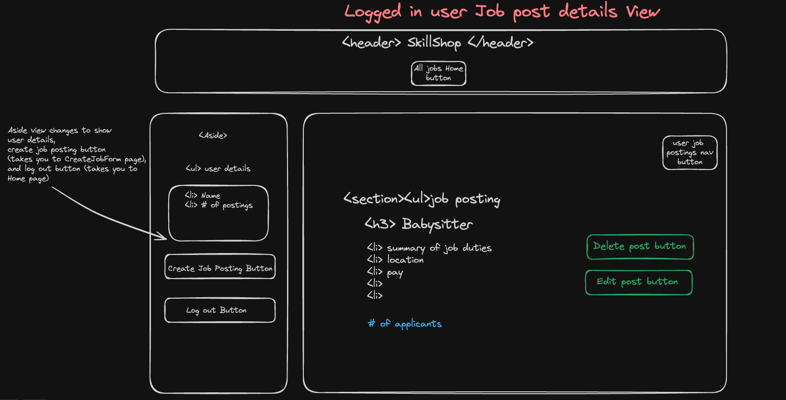
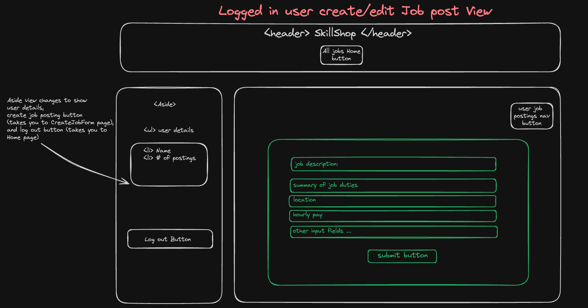

# SkillShop

Welcome to SkillShop, the premier platform for connecting homeowners with skilled freelance professionals for renovation projects. Our app streamlines the process of posting, discovering, and applying for projects, ensuring a seamless match between project requirements and professional expertise. Explore our application to kickstart your next renovation project or to find your next job opportunity.

Visit our deployed application here: [Deployed Application Link]

## Setup Instructions

To get started with SkillShop on your local machine, follow these simple steps:

1. **Clone the repository**: Clone the SkillShop repository to your local machine using the command:

   ```bash
   git clone https://github.com/josebarrios23/startup-project
   ```

2. **Install dependencies**: Navigate to the cloned repository's directory and install the necessary dependencies by running:

   ```bash
   npm install
   ```

3. **Environment setup**: Set up your environment variables by creating a `.env` file in the root directory. Refer to the `.env.example` file for the required variables.

4. **Start the application**: Launch the application on your local development server by running:

   ```bash
   npm start
   ```

   This command will start the React application and open it in your default web browser.

5. **Explore SkillShop**: With the application running, explore the functionalities available, including project postings, applications, and user communications.

For further details on deployment, API integration, or advanced configuration, please refer to the [Documentation](#).


## User Stories

**User Story 1: Homeowner**

- As a homeowner, I want to create a project listing for my renovation, specifying the positions needed and the budget, so that I can efficiently find professionals for the job.

**User Story 2: Freelance Professional**

- As a freelance professional, I want to search for available projects, filter them based on criteria like budget and timeline, and apply for projects that match my skills and availability.

**User Story 3: Experienced Electrician**

- As an experienced electrician, I want to receive notifications whenever a project requiring an electrician is posted in my area, so I can quickly express my interest and secure jobs.

**User Story 4: Project Manager**

- As a project manager, I want to track the progress of multiple renovation projects I've taken on through the app, receive updates from hired professionals, and communicate with homeowners to ensure successful project completion.

**User Story 5: Homeowner Seeking Multiple Services**

- As a homeowner seeking multiple services, I want to post a renovation project that requires various professionals, such as plumbers, carpenters, and painters, and manage all the applications and communication within a single project listing.

## User Personas

**User Persona 1: Homeowner**

- **Background:** John is a dedicated homeowner who cherishes quality time with his family in their backyard. He has a clear vision of transforming his outdoor space into an inviting oasis. However, John lacks the expertise and time to execute the renovation himself.

- **With the help of this app:** John can efficiently manage his backyard renovation project, connecting with the right professionals to bring his vision to life without the complexities of traditional contractor searches, job postings, and hiring processes.

**User Persona 2: Freelance Professional**

- **Background:** Sarah is a highly skilled and experienced landscaper who is passionate about her craft. She has been working as a freelance landscaper for several years and takes great pride in her work. Sarah is always on the lookout for landscaping projects in her local area and beyond.

- **With the help of this app:** Sarah can easily find landscaping projects that match her skills and preferences, streamlining the process of connecting with homeowners and securing jobs without the hassle of extensive searches or negotiations.

## Wire Frames for SkillShop App

Check out how we planned our app design:

### Data Flow

This is how Data will flow from our Api:



### Landing Page Wireframe



### Applicant Form View (to apply to existing job posts)



### Create New User (to post jobs) Form View


### Logged In User Home Page View



### Logged In User Job Post Details View



### Logged In User Create-Edit Job Post View

